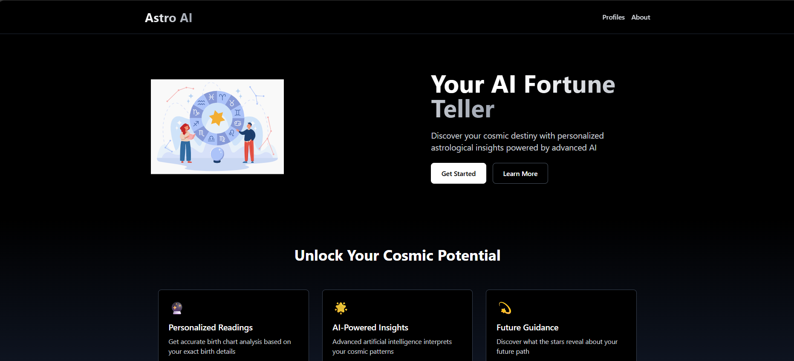
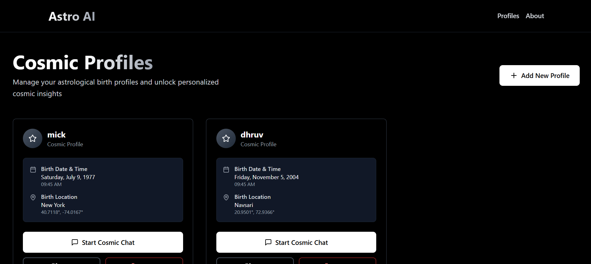
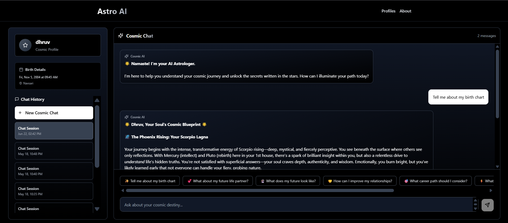

# 🌌 Astro AI — Frontend

Welcome to the frontend of **Astro AI**, your personalized AI Astrologer. This web interface allows users to generate astrological insights using birth details, navigate past sessions, and chat with a cosmic assistant — all wrapped in a sleek, responsive UI.

---

## 🚀 Features

- 🌟 **AI-Powered Astrological Chat**  
  Get real-time answers from an AI trained on astrology data and logic.

- 🧑‍💼 **Profile-Based Birth Detail Storage**  
  Each user can create and access birth charts based on their date, time, and place of birth.

- 💬 **Session-Based Chat History**  
  Revisit previous astrological chats stored locally using IndexedDB.

- 📱 **Responsive UI**  
  Works seamlessly on mobile, tablet, and desktop.

- 🌗 **Dark Theme**  
  Immersive dark mode design with animated transitions.

---

## 🛠 Tech Stack

| Layer       | Tech                          |
|-------------|-------------------------------|
| Frontend    | React + TypeScript            |
| Routing     | React Router DOM              |
| UI Icons    | Lucide React                  |
| Styling     | Tailwind CSS                  |
| Markdown    | react-markdown + remark-gfm   |
| State Mgmt  | useState, useEffect, useRef   |
| Local DB    | Dexie.js (IndexedDB wrapper)  |

---

## 📁 Folder Structure

``` bash
astro-ai-frontend/
├── public/
├── src/
│ ├── components/
│ │ ├── navBar.tsx
│ │ ├── chatPage.tsx
│ │ └── ...
│ ├── db.ts
│ ├── App.tsx
│ ├── main.tsx
│ └── ...
├── tailwind.config.js
├── package.json
└── tsconfig.json
```

---

## 📦 Setup & Installation

### Prerequisites

- Node.js v18+
- pnpm / npm / yarn

### 1. Clone the repository

```bash
git clone https://github.com/MrD0511/Astro_AI_Client.git
cd Astro_AI_Client
```
### 2. Install dependencies

``` bash
npm install   # or pnpm install / yarn install
```

### 3. Start development server

``` bash
npm run dev       # or pnpm dev / yarn dev
```

ℹ️ The frontend expects the backend running at http://localhost:8000

Make sure the backend is up for chat functionality to work.

---

## ⚙️ Configuration

You can adjust the backend URL or other environment settings by creating a .env file:

``` bash
VITE_BACKEND_URL=http://localhost:8000
```

Access this via:

``` bash
import.meta.env.VITE_BACKEND_URL
```

### 🧪 Local Database (IndexedDB)
- We're using Dexie.js to manage chat history and birth details offline.

- Chats are persisted under Chats and Messages tables.

- Users can revisit old sessions, even after refreshing the page.

- Use dev tools → Application → IndexedDB to inspect local DB.

---

## 📸 Screenshots

### Home


### Profiles


### Chat interface


---

## 🤝 Contribution
- Fork this repository

- Create a new branch (feat/your-feature)

- Commit your changes

- Push and open a PR

---

## 📄 License
[MIT License](./LICENSE) © 2025 Dhruv Sharma

---

## ✨ Credits
Made with 💫 by Dhruv Sharma
Connect on
[LinkedIn](https://www.linkedin.com/in/dhruvsharma005) | [Website](https://www.dhruvsharma.me)

